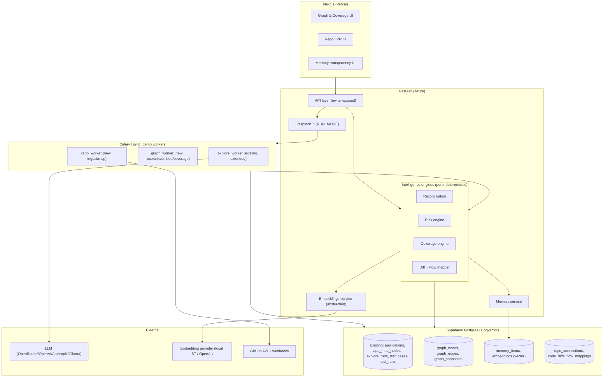
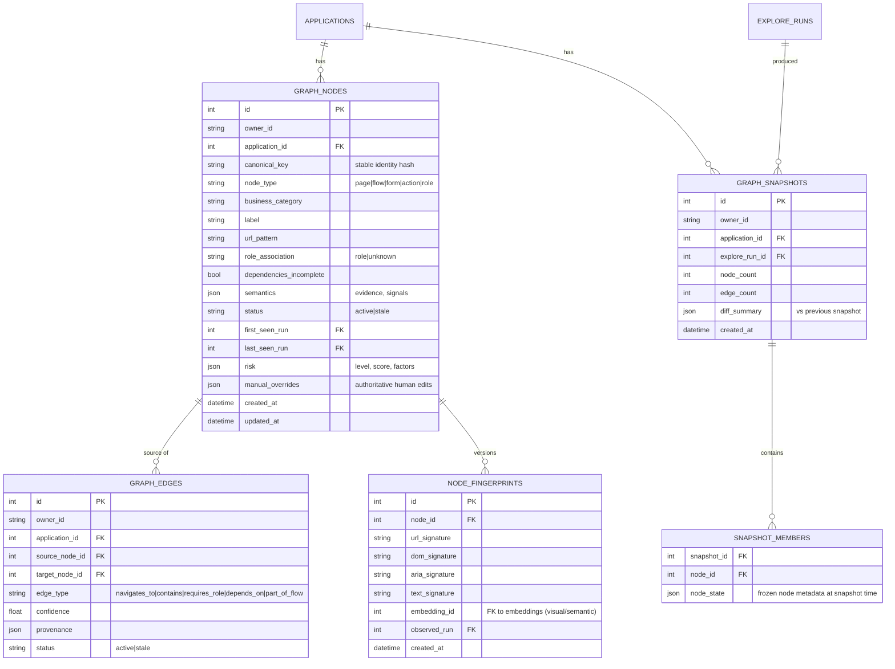
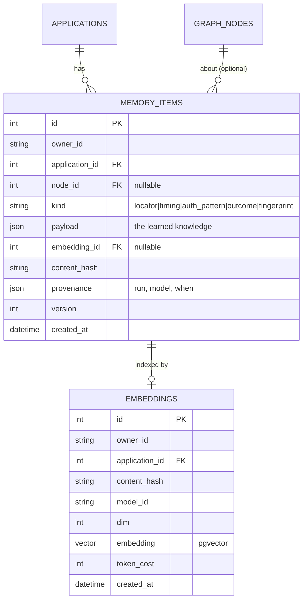
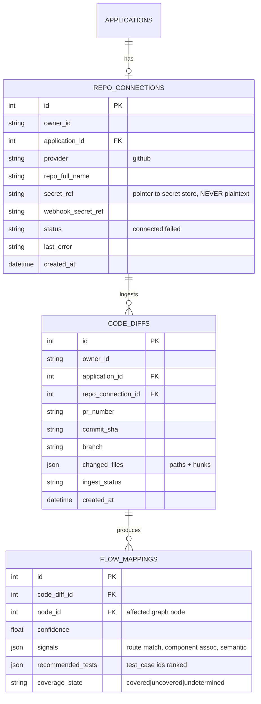

# Design Document

Feature: Application Intelligence

## Overview

Application Intelligence adds a durable "brain" on top of the existing browser-use execution substrate. It turns the current flat explore output (`Application` → `ExploreRun` → `AppMapNode`) into four compounding capabilities: a **versioned Application Graph**, **Coverage Intelligence**, a **semantic Memory**, and **PR Intelligence**.

The design is deliberately **layered** so it can be built and shipped incrementally without ever breaking the running product:

- **Layer 0 — Foundations:** `pgvector` enablement, an embeddings service abstraction, and additive schema (all new tables; nothing dropped).
- **Layer 1 — Graph + Reconciliation:** persistent graph, fingerprint identity, idempotent reconciliation, append-only snapshots, snapshot diffing.
- **Layer 2 — Risk + Coverage:** deterministic risk scoring; multi-signal coverage engine that supersedes the current substring heuristic.
- **Layer 3 — Memory:** durable learned knowledge with vector retrieval, write-back with durable queue, retention/compaction.
- **Layer 4 — PR Intelligence:** repo connection, webhook ingestion, diff→flow mapping, risk-ranked test recommendation feeding the existing CI webhook.
- **Layer 5 — UX:** graph visualization, coverage gaps, memory transparency, repo/PR views.

Every layer respects the existing deployment reality: **shared Supabase Postgres** (local + Azure), **`RUN_MODE` dispatch** (`sync_demo` in-process / `celery` via Upstash Redis), **Supabase JWT owner scoping**, and the **Vercel client→backend rewrite**. All heavy work runs asynchronously on the existing worker fabric.

### Design principles (traceable to requirements)

- **Additive, non-destructive** (R11): new tables + a parallel `graph_worker`, extending `explore_worker` rather than replacing it. Existing endpoints keep working.
- **Deterministic where it matters** (R3.7, R7.8): risk and recommendation are pure functions of their inputs; ties broken by canonical identity.
- **Explainable everywhere** (R1.7, R2.5, R3.4, R4.8, R7.6): every derived fact carries provenance and a factor breakdown.
- **Graceful degradation** (R5.9, R10.4): vector/LLM/repo outages downgrade behavior, never hard-fail a run.
- **Tenant-isolated, secret-safe** (R9): every query owner-scoped; 404 (not 403) on mismatch; secrets never leave the server.
- **Cost-governed** (R5.11, R10.5): content-hash dedup on embeddings/LLM calls; usage recorded.

---

## Architecture

### System context



### Where new code lives (module map)

```
backend/app/
├── models.py                      # + graph/memory/repo models (additive)
├── explore_worker.py              # EXTENDED: on completion, enqueue reconciliation
├── graph_worker.py                # NEW: reconcile, embed, recompute coverage/risk
├── repo_worker.py                 # NEW: ingest diffs, run diff→flow mapping
├── intelligence/                  # NEW package — pure, testable engines
│   ├── fingerprint.py             # node fingerprint computation
│   ├── reconciliation.py          # merge discoveries → graph, snapshots, diff
│   ├── risk.py                    # deterministic risk scoring
│   ├── coverage.py                # multi-signal coverage classification
│   ├── mapping.py                 # diff → affected-flow → recommended tests
│   └── embeddings.py              # embedding provider abstraction + cache
├── memory.py                      # memory read/write + durable write-back queue
├── integrations/
│   └── github_client.py           # NEW: repo verify, PR files, webhook verify
├── main.py                        # + owner-scoped API endpoints
└── migrations/                    # NEW: idempotent SQL migrations + backfill
```

The `intelligence/` engines are **pure functions** (input data → output data, no I/O). Workers and the API do the I/O and call the engines. This makes the deterministic/explainable requirements directly unit-testable (R3.7, R7.8) and satisfies the property-testing approach.

---

## Layer 0 — Foundations

### 0.1 pgvector enablement

`pgvector` is available on Supabase (`CREATE EXTENSION IF NOT EXISTS vector`). We enable it via an idempotent migration and add the Python `pgvector` package (`pgvector.sqlalchemy.Vector`) to `requirements.txt`.

- Embedding dimension is **fixed per provider** and stored with each vector so we never compare vectors of different dimensions.
- Indexing: **HNSW** (`vector_cosine_ops`) for approximate nearest-neighbor at scale; created lazily once a table exceeds a row threshold to avoid indexing overhead on tiny sets.

### 0.2 Embeddings service abstraction (`intelligence/embeddings.py`)

A provider-agnostic embedder, mirroring the existing `get_llm()` pattern, chosen by env:

```python
class EmbeddingProvider(Protocol):
    dim: int
    model_id: str
    def embed(self, texts: list[str]) -> list[list[float]]: ...

def get_embedder() -> EmbeddingProvider: ...
```

- **Default (bootstrapper / zero-cost):** `sentence-transformers` (already installed) with `all-MiniLM-L6-v2` (dim 384) running in the worker. No API cost, works offline, matches the existing "Bootstrapper Mode" story.
- **Production option:** OpenAI `text-embedding-3-small` (dim 1536) via the existing OpenAI/OpenRouter key, selectable with `EMBEDDING_PROVIDER=openai`.
- **Cost governance (R5.11, R10.5):** every embeddable string is hashed (`sha256`); an `embeddings` row keyed by `(content_hash, model_id)` is reused if present — we never re-embed unchanged content. Token/estimated-cost recorded per embed batch.
- **Dimension change safety:** switching providers changes `dim`; embeddings are keyed by `model_id`, and similarity queries filter by the active `model_id`, so mixed-dimension data never collides. A provider switch simply re-embeds lazily on demand.
- **Degradation (R5.9, R10.4):** if the embedder raises (model load failure, API down), callers catch and fall back to identity-only retrieval; the embedding is queued for later backfill.

### 0.3 Additive schema (Layer 0 tables introduced; later layers add their own)

All migrations are `CREATE TABLE IF NOT EXISTS` / `ADD COLUMN IF NOT EXISTS`, applied against the shared Supabase DB (same pattern already used for assertions & explore tables). Nothing existing is dropped or altered destructively (R11.1).

---

## Layer 1 — Application Graph + Reconciliation

### 1.1 Data model



Key modeling decisions:

- **`canonical_key`** is the stable identity (R1.2). It is a hash derived from the most stable fingerprint components (primarily normalized `url_pattern` + `node_type`, falling back to text/aria signature for URL-less nodes like modal forms). The `AppMapNode.id` remains as the raw discovery record; graph nodes reference back to their originating discoveries for provenance but are not coupled to a single row.
- **`node_fingerprints`** is versioned (R5.7): each reconciliation that observes a node appends a fingerprint version if it drifted. Old versions are retained (bounded by retention policy) enabling future self-healing re-identification.
- **`status = stale`** never deletes (R1.3, R1.10): unre-observed nodes/edges are marked stale, preserving history.
- **`manual_overrides`** (R2.7, R3.5): a JSON of human-authoritative fields (type, category, role, risk). Reconciliation and risk recomputation **read overrides last** and never clobber them.
- **Snapshots are append-only** (R1.4, R1.10): `graph_snapshots` + `snapshot_members` freeze the full state; diffing (R1.5) compares two snapshots' frozen member sets.

### 1.2 Fingerprint computation (`intelligence/fingerprint.py`)

A node fingerprint is a composite of deterministic signatures computed from explore evidence:

- **`url_signature`** — normalized URL: strip query/fragment, collapse numeric/UUID path segments to `:id` (so `/orders/123` and `/orders/456` are one node). This is the primary identity signal.
- **`dom_signature`** — a structural hash of the salient DOM (tag skeleton of interactive elements), robust to text changes.
- **`aria_signature`** — hash of ARIA roles/landmarks present.
- **`text_signature`** — hash of key visible headings/labels (normalized, lowercased).
- **`embedding`** — a semantic embedding of the node's label+description+key text, stored in `embeddings`, used for fuzzy matching when structural signals are ambiguous.

**Identity match score** between a discovery and an existing node = weighted combination (url_signature exact match dominates; dom/aria/text/embedding similarity break ties and handle URL-less nodes). Above a configurable threshold → same node.

### 1.3 Reconciliation algorithm (`intelligence/reconciliation.py`, run in `graph_worker`)

Pure function `reconcile(existing_graph, discoveries, run_id) -> ReconcileResult`:

```
1. For each discovery:
     - compute fingerprint
     - find best-matching active node by identity match score
     - if score >= MATCH_THRESHOLD → MATCH (update last_seen, append fingerprint version if drifted)
     - else → NEW node (assign canonical_key)
2. Any active node NOT matched this run → mark STALE (do not delete)
3. Derive edges from discovery evidence (navigates_to from visited sequence,
   contains from page→form, part_of_flow from flow steps, requires_role/depends_on
   where evidenced). Merge edges idempotently by (source, target, type).
4. Re-apply manual_overrides on matched nodes (overrides win).
5. Produce a new GRAPH_SNAPSHOT + SNAPSHOT_MEMBERS; compute diff_summary vs previous snapshot.
6. Return ReconcileResult (nodes added/updated/staled, edges added/staled, snapshot).
```

**Idempotency (R1.6, R10.3):** re-running the same discoveries produces MATCHes (no new nodes), identical edge set, and a snapshot whose diff vs the prior is empty. Guaranteed because canonical_key + edge dedup key are deterministic.

**Concurrency (R10.7):** reconciliation for a given `application_id` acquires a Postgres advisory lock (`pg_advisory_xact_lock(hashtext(app_id))`); a second concurrent explore's reconciliation serializes behind it, so the shared graph can't be corrupted.

**Integration point (R11.3):** `explore_worker.explore_application`, on successful completion, enqueues `graph_worker.reconcile_explore(explore_run_id)` via the existing `_dispatch_*` mechanism. The explore worker's current behavior (writing `AppMapNode`, live steps, status) is unchanged; reconciliation is a new downstream step.

### 1.4 Snapshot diffing (R1.5, R8.3)

`diff_snapshots(a, b)` compares frozen `snapshot_members`: added nodes (in b not a by canonical_key), removed/staled (in a not b), changed (same key, different metadata/fingerprint), edge deltas. Surfaced as "since last explore: +3 flows, −1, ~2".

---

## Layer 2 — Risk + Coverage

### 2.1 Risk engine (`intelligence/risk.py`) — pure, deterministic (R3)

```python
def score_node(node, graph, signals) -> RiskResult:
    # RiskResult = {level, score: 0..100, factors: [{name, contribution, evidence}]}
```

Factors (each contributes a weighted sub-score; all recorded for explainability R3.4):

- **Business category weight** — billing/checkout/auth/payment = high; content/navigation = low. (R3.2)
- **Graph centrality** — in-degree of `depends_on`/`part_of_flow` edges: nodes many flows depend on score higher. (R3.2)
- **Role sensitivity** — admin/destructive actions score higher. (R3.2)
- **Historical failure rate** — from Memory, if present. (R3.3)
- **Owner-supplied importance hint** — optional. (R3.3)

**Determinism (R3.7):** pure function of (node, graph, signals). Ties in ordering broken by `canonical_key` (stable). No randomness. Different internal paths allowed as long as identical inputs → identical output. Recomputed on reconciliation, on new failure signals, and on manual override (R3.6), with a recomputation event recorded. `manual_overrides.risk` wins over computed (R3.5).

### 2.2 Coverage engine (`intelligence/coverage.py`) — multi-signal (R4)

Supersedes the substring heuristic currently inline in `GET /api/applications/{id}/map`. For each node, classify `covered | partially_covered | uncovered` with confidence ∈ [0,1] and evidence list:

Signals, strongest first:
1. **Explicit link (authoritative, R4.3):** a `coverage_links` row created when a test was generated from that node, or manually linked. Confidence baseline high.
2. **Route correspondence (R4.2b):** test's `target_url` normalized-matches node's `url_pattern`.
3. **Semantic similarity (R4.2c):** cosine similarity between the test's intent embedding (name + prompt + assertions) and the node's semantics embedding, via pgvector. Above a threshold contributes partial coverage.

Confidence also incorporates **recent pass/fail** (R4.7): a node with a linked, recently-passing test scores higher confidence than one whose only test is failing; confidence stays in [0,1] with no hard minimum. "Test exists" vs "test exists and passes" are distinct inputs (R4.7).

- **Rollups (R4.4):** application- and category-level coverage, **risk-weighted** (a covered Trivial node and an uncovered Critical node are not equal). Exposed via API.
- **Gaps (R4.5):** uncovered/partial nodes ranked by risk, each carrying its `suggested_prompt` for one-click generation.
- **Recompute triggers (R4.6):** graph change, test added/edited/deleted, run completed → recompute affected verdicts (enqueued to `graph_worker`), no re-explore needed.
- **Orphan handling (R4.9):** a `coverage_link` to a node that becomes stale is flagged `orphaned`, surfaced for review, not dropped.
- **Explainability (R4.8):** per node, the API returns the contributing signals and evidence.

### 2.3 Superseding the existing heuristic (R11.4)

`GET /api/applications/{id}/map` keeps its response shape but its `is_covered`/`covered_nodes` fields are now populated by the coverage engine's stored verdicts (read from `coverage_verdicts`), not recomputed by substring match. If verdicts haven't been computed yet (pre-migration app), it falls back to the old heuristic labeled low-confidence, then a background recompute upgrades it.

---

## Layer 3 — Memory (`memory.py` + `intelligence/embeddings.py`)

### 3.1 Data model



- **Kinds (R5.1):** `locator` (preferred locator hierarchy that worked), `timing` (observed durations), `auth_pattern`, `outcome` (historical pass/fail summary per node), `fingerprint` (linked to node_fingerprints).
- **Vector retrieval (R5.2, R5.3):** `embeddings.embedding` is a pgvector column with an HNSW cosine index. Retrieval = identity lookup (by node_id/kind) ∪ semantic search (embed the query, `ORDER BY embedding <=> :q LIMIT k`), tenant- and application-scoped in the WHERE clause.
- **Write-back with durable queue (R5.5, R5.5a):** runs emit memory updates. `memory.write(...)` attempts immediate persist; on DB/embedder failure it enqueues to a `memory_write_queue` table (durable) and a periodic `graph_worker` task drains it with retry. The in-flight run always completes.
- **Retention/compaction (R5.8):** keep latest N fingerprint versions per node; summarize old `timing`/`outcome` items into aggregates. Configurable via env; enforced by a periodic compaction task.
- **Degradation (R5.9):** if vector backend unavailable, retrieval returns identity-only results and the run proceeds.
- **Transparency (R5.10):** `GET /api/applications/{id}/memory` (paginated, owner-scoped) exposes what Leaka "knows".
- **Cost guard (R5.11):** `embeddings` keyed by `(content_hash, model_id)`; unchanged content is never re-embedded.

### 3.2 How Memory is consumed

The explore/test workers, before acting on a known node, call `memory.retrieve(app_id, node)` to fetch preferred locators + timing hints and pass them into the agent's task context. This is the seed of self-healing and faster runs (the recovery/self-healing engine itself is a later spec that consumes this).

---

## Layer 4 — PR Intelligence

### 4.1 Data model



### 4.2 GitHub client (`integrations/github_client.py`)

- **Connect + verify (R6.1, R6.2):** validate token + repo reachability via GitHub REST; store token only via secret ref (never returned by any read API — R9.3). Surface connected/failed + reason.
- **Diff ingestion (R6.3):** two paths — (a) webhook on `pull_request`/`push`, (b) on-demand fetch of PR files (`GET /repos/{owner}/{repo}/pulls/{n}/files`). Persist changed file paths + patch hunks.
- **Webhook verification (R6.7, R9.5):** verify `X-Hub-Signature-256` HMAC-SHA256 over the **raw request body** using the stored webhook secret, timing-safe compare; reject unauthenticated/malformed; dedupe delivery IDs to reject replays. (FastAPI: read raw body before JSON parsing.)
- **Untrusted code (R6.6, R9.4):** ingested code is never executed against runtime. Structural analysis (route/identifier extraction, optional AST parse) runs in-process as pure parsing or in a sandboxed interpreter with no network/fs-write/process-spawn; code text fed to the LLM is fenced and treated as data (prompt-injection-aware).

### 4.3 Diff → Flow mapping (`intelligence/mapping.py`) — deterministic (R7.8)

Pure function `map_diff(diff, graph, coverage) -> list[FlowMapping]`:

Signals (each explainable, R7.2, R7.6):
1. **Route/path correspondence** — changed file paths / route definitions matched to node `url_pattern`s.
2. **Component→page association** — learned from Memory/graph (which components render which pages), matched to changed component files.
3. **Semantic similarity** — embedding similarity between changed identifiers/symbols and node semantics.

Output: ranked affected nodes → recommended `test_case` ids (via coverage links, R7.3), ranked by node risk. Each recommendation carries the full chain `changed file → affected node → covering test` (R7.6).

- **No-coverage warning (R7.4):** affected flow with no covering test → high-confidence warning + suggested prompt; if coverage never computed → labeled `undetermined`.
- **Empty vs stale graph (R7.7):** empty → explicit "explore first, no recommendations"; stale → conservative "run all high-risk flows" labeled low-confidence + suggest re-explore.
- **CI integration (R7.5):** recommendation exposed in a shape the existing `POST /api/webhooks/ci` consumes, so a PR triggers exactly the recommended tests.

---

## Components and Interfaces

All endpoints owner-scoped via existing `get_current_user`; 404 on cross-tenant (R9.2). All list endpoints paginated (R10.6).

**Graph**
- `GET /api/applications/{id}/graph?cursor=&limit=` → paginated nodes+edges (current active graph)
- `GET /api/applications/{id}/graph/nodes/{node_id}` → node detail: semantics, risk (with factors), coverage verdict (with evidence), memory summary, provenance
- `PATCH /api/applications/{id}/graph/nodes/{node_id}` → manual override (type/category/role/risk) — authoritative
- `GET /api/applications/{id}/snapshots` / `GET .../snapshots/{a}/diff/{b}` → snapshot list + diff

**Coverage**
- `GET /api/applications/{id}/coverage` → rollups (app + per-category, risk-weighted) + gaps (ranked)
- (existing `GET /api/applications/{id}/map` retained, now backed by stored verdicts — R11.4)

**Memory**
- `GET /api/applications/{id}/memory?kind=&cursor=` → paginated memory items (no secrets)

**Repo / PR**
- `POST /api/applications/{id}/repo` → connect (token in body, stored as secret, never echoed)
- `GET /api/applications/{id}/repo` → status only (masked)
- `DELETE /api/applications/{id}/repo`
- `POST /api/webhooks/github` → signed webhook intake (raw-body HMAC verified)
- `GET /api/applications/{id}/diffs` / `GET .../diffs/{diff_id}/recommendation` → affected flows + recommended tests + chains
- `POST /api/applications/{id}/diffs/{diff_id}/run` → trigger recommended tests (reuses CI dispatch)

**Internal dispatch (workers)**
- `graph_worker.reconcile_explore(explore_run_id)`
- `graph_worker.recompute_coverage(application_id, reason)`
- `graph_worker.drain_memory_queue()` / `compact_memory()`
- `repo_worker.ingest_diff(repo_connection_id, pr_number|commit_sha)`
- `repo_worker.map_diff(code_diff_id)`

---

## Data Models

| Table | Purpose | Key columns |
|---|---|---|
| `graph_nodes` | persistent graph nodes | canonical_key, node_type, business_category, risk(json), manual_overrides(json), status |
| `graph_edges` | typed relationships | source/target, edge_type, confidence, status |
| `node_fingerprints` | versioned identity | url/dom/aria/text signatures, embedding_id |
| `graph_snapshots` | append-only history | explore_run_id, diff_summary |
| `snapshot_members` | frozen node state per snapshot | snapshot_id, node_id, node_state |
| `coverage_verdicts` | per-node coverage | state, confidence, evidence(json) |
| `coverage_links` | authoritative test↔node links | test_case_id, node_id, source(generated/manual), orphaned |
| `memory_items` | learned knowledge | kind, payload(json), embedding_id, version, provenance |
| `embeddings` | pgvector store | content_hash, model_id, dim, embedding(vector), token_cost |
| `memory_write_queue` | durable write-back | payload, attempts, next_retry_at |
| `repo_connections` | linked repos | provider, repo_full_name, secret_ref, status |
| `code_diffs` | ingested diffs | pr_number, commit_sha, changed_files(json) |
| `flow_mappings` | diff→flow results | node_id, confidence, signals(json), recommended_tests(json) |

All owner_id + application_id scoped; all created via idempotent migrations.

---

## Error Handling

- **Job failures (R10.2):** every worker task wraps its body; on failure it writes a classified reason (reuse `_classify_api_error`-style mapping) to the owning run/record and preserves prior state. If classification itself fails, a safe generic reason is written and state preserved — never escalates to corruption.
- **Partial-write safety (R10.2):** reconciliation, coverage recompute, and mapping run inside a DB transaction; snapshots only commit atomically. Advisory locks prevent concurrent corruption (R10.7).
- **Degradation matrix (R10.4):**
  - Embedder down → identity-only retrieval + queue for backfill.
  - Vector store down → identity-only; coverage semantic signal skipped (verdict still computed from explicit + route signals, labeled reduced-confidence).
  - LLM down → explore/classification deferred; existing runs unaffected.
  - GitHub down → ingestion marked failed with reason; no partial mapping written (R6.5).
- **Idempotency (R10.3):** reconciliation (canonical_key), embedding (content_hash), webhook (delivery id dedupe), mapping (deterministic) all safe to retry.
- **Untrusted input (R9.4):** page/code text passed to the LLM is delimited and never interpreted as instructions.

---

## Correctness Properties

Because the `intelligence/` engines are pure functions, they are directly unit- and property-testable. These are the executable correctness properties the implementation must uphold.

### Property 1: Reconciliation idempotency
`reconcile(reconcile(G, D), D)` produces no new nodes and an empty snapshot diff for any graph G and discovery set D.
**Validates: Requirements 1.6, 10.3**

### Property 2: Fingerprint stability
For a fixed discovery, `canonical_key` is invariant across repeated computation and across cosmetic text changes that don't alter url/structure.
**Validates: Requirements 1.2**

### Property 3: Snapshots are append-only
No operation reduces the count of existing snapshots or mutates a frozen `snapshot_members` row.
**Validates: Requirements 1.10**

### Property 4: Risk determinism
`score_node(n, G, S) == score_node(n, G, S)` for all inputs; permuting evaluation order of equal-risk nodes never changes any score.
**Validates: Requirements 3.7**

### Property 5: Manual override supremacy
After reconciliation or risk recompute, any field present in `manual_overrides` equals the override value.
**Validates: Requirements 2.7, 3.5**

### Property 6: Coverage monotonicity of evidence
Adding an authoritative `coverage_link` never lowers a node's coverage state; removing all tests never raises it.
**Validates: Requirements 4.1, 4.3**

### Property 7: Coverage confidence bounds
Every coverage verdict confidence is within [0.0, 1.0].
**Validates: Requirements 4.7**

### Property 8: Tenant isolation
For any resource, a query by a non-owner returns empty/404 — no cross-tenant row is ever returned.
**Validates: Requirements 9.1, 9.2**

### Property 9: Mapping determinism
`map_diff(d, G, C)` is a pure function — identical inputs yield identical recommendation ordering.
**Validates: Requirements 7.8**

### Property 10: Empty vs stale recommendation
An empty graph yields "no recommendations available"; the system never returns a fabricated list for an unexplored application.
**Validates: Requirements 7.7**

### Property 11: Embedding dedup
Embedding the same `(content, model_id)` twice performs at most one provider call and yields exactly one `embeddings` row.
**Validates: Requirements 5.11**

### Property 12: Webhook authenticity
A payload whose HMAC doesn't match the secret is always rejected; a replayed delivery id is always rejected.
**Validates: Requirements 6.7, 9.5**

## Testing Strategy

The pure engines are covered by the property-based tests above. Beyond those:

### Integration tests
- Explore → reconcile → snapshot: run explore against `saucedemo.com`, assert graph nodes + snapshot + diff produced; re-run, assert idempotent (no dupes).
- Generate-test-from-node → coverage link created → node flips to `covered`.
- Repo connect (mock GitHub) → webhook signed delivery → diff ingested → mapping → recommended tests → CI dispatch.
- Degradation: force embedder/vector failure, assert coverage + memory still return (reduced confidence) and no run fails.

### Migration tests
- Idempotent migration runs twice cleanly; backfill upgrades existing `AppMapNode` rows into `graph_nodes` preserving label/url/description/suggested_prompt with zero data loss; existing `/map` endpoint keeps working throughout.

---

## Migration & Rollout (R11)

1. **Migration M1 (Layer 0):** `CREATE EXTENSION vector`; create `embeddings`; add `pgvector` to requirements.
2. **Migration M2 (Layer 1):** graph/snapshot/fingerprint tables.
3. **Backfill B1:** for each existing Application with `AppMapNode`s, synthesize graph nodes (canonical_key from url/label) + an initial snapshot. Idempotent, re-runnable.
4. **Migration M3 (Layer 2):** coverage tables; wire `explore_worker` → reconcile; switch `/map` to stored verdicts with heuristic fallback.
5. **Migration M4 (Layer 3):** memory tables + write queue.
6. **Migration M5 (Layer 4):** repo/diff/mapping tables; GitHub client + webhook route.
7. Each layer ships independently; product remains functional after each. `sync_demo` and `celery` both exercised. Deploy to Azure only after local verification (shared Supabase means migrations apply once to both).

## Design decisions & rationale

- **Embeddings default to local sentence-transformers, not a paid API.** It's already installed, zero-cost, matches Bootstrapper Mode, and satisfies cost governance out of the box; OpenAI embeddings are an opt-in upgrade. The abstraction means the choice is one env var.
- **pgvector on the existing Postgres, not a separate vector DB.** Avoids new infra, keeps tenant scoping in the same WHERE clause, and Supabase supports it natively. A dedicated store (Pinecone/Qdrant) would add ops burden with no benefit at this scale — revisit only if graph/memory volume demands it.
- **Pure engines + thin workers.** Makes the deterministic/explainable requirements testable and keeps the risky I/O (LLM, DB, GitHub) isolated at the edges.
- **Extend `explore_worker`, add `graph_worker`/`repo_worker` — never rewrite.** Guarantees the existing product keeps running through every layer (R11.3).
- **Stale-not-delete + append-only snapshots.** History is a moat and an audit requirement; destroying it to save space is a prototype mistake we explicitly avoid.
