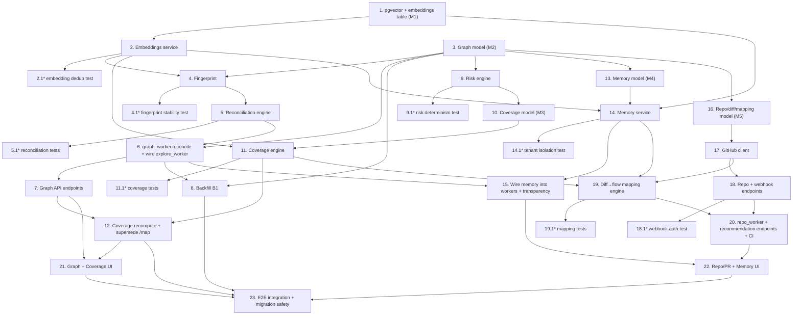

# Implementation Plan

## Overview

Tasks are grouped by the design's layers (L0–L5). Each layer is independently shippable and leaves the product functional. Property tests (Properties 1–12 from design.md) are written alongside the engine that must satisfy them and are marked optional (`*`). All schema work uses idempotent migrations against the shared Supabase Postgres; all long work runs on the existing `RUN_MODE` dispatch. Layers must be built in order (L0 → L5) because each depends on the persistence and engines of the ones before it.

## Tasks

### Layer 0 — Foundations (pgvector + embeddings)

- [x] 1. Enable pgvector and add the vector dependency
  - Write an idempotent migration `M1` that runs `CREATE EXTENSION IF NOT EXISTS vector` against the shared Postgres
  - Add `pgvector` to `backend/requirements.txt`; confirm `pgvector.sqlalchemy.Vector` imports
  - Add the `embeddings` table (owner_id, application_id, content_hash, model_id, dim, embedding vector, token_cost, created_at) via migration `M1`
  - Run the migration; verify the extension and table exist in Supabase
  - _Requirements: 5.3, 11.1_

- [x] 2. Build the embeddings service abstraction (`intelligence/embeddings.py`)
  - Define an `EmbeddingProvider` protocol (`dim`, `model_id`, `embed(texts)`)
  - Implement a local `sentence-transformers` provider (`all-MiniLM-L6-v2`, dim 384) as the default
  - Implement an OpenAI provider (`text-embedding-3-small`, dim 1536) selectable via `EMBEDDING_PROVIDER` env
  - Add `get_embedder()` mirroring `get_llm()`; read provider from env at call time
  - Implement `embed_and_store(texts, owner_id, application_id)`: hash each string, reuse existing `(content_hash, model_id)` rows, only call the provider for misses, record token_cost
  - Implement graceful failure: on provider error, raise a typed `EmbeddingUnavailable` callers can catch
  - _Requirements: 5.2, 5.3, 5.11, 10.4, 10.5_

- [x]* 2.1 Write property test for embedding dedup (Property 11)
  - Assert embedding the same `(content, model_id)` twice performs ≤1 provider call and yields exactly one `embeddings` row (mock the provider to count calls)
  - _Requirements: 5.11_

### Layer 1 — Application Graph + Reconciliation

- [x] 3. Add graph data model and migration `M2`
  - Add SQLAlchemy models: `GraphNode`, `GraphEdge`, `NodeFingerprint`, `GraphSnapshot`, `SnapshotMember` (per design Data Models), all owner_id + application_id scoped
  - Write idempotent migration `M2` creating the tables; add HNSW index creation deferred to a helper (created lazily)
  - Run migration; verify tables exist
  - _Requirements: 1.1, 1.2, 1.7, 1.10, 11.1_

- [ ] 4. Implement fingerprint computation (`intelligence/fingerprint.py`)
  - Implement `url_signature` (strip query/fragment, collapse numeric/UUID path segments to `:id`)
  - Implement `dom_signature`, `aria_signature`, `text_signature` (deterministic hashes of salient structure/roles/text)
  - Implement `compute_canonical_key(discovery)` (primarily url_signature + node_type; fallback to text/aria for URL-less nodes)
  - Implement `identity_match_score(discovery, node)` (weighted combination) returning 0..1
  - _Requirements: 1.2, 2.5_

- [ ]* 4.1 Write property test for fingerprint stability (Property 2)
  - Assert `canonical_key` is invariant across repeated computation and cosmetic text changes that don't alter url/structure
  - _Requirements: 1.2_

- [ ] 5. Implement the reconciliation engine (`intelligence/reconciliation.py`) — pure function
  - Implement `reconcile(existing_graph, discoveries, run_id) -> ReconcileResult` per the design algorithm (match/new/stale, edge derivation, manual-override re-apply, snapshot build, diff_summary)
  - Implement deterministic edge dedup key `(source, target, edge_type)`
  - Implement `diff_snapshots(a, b)` (added/removed/changed nodes, edge deltas)
  - _Requirements: 1.3, 1.4, 1.5, 1.6, 2.2, 2.3, 2.3a, 2.4, 10.3_

- [ ]* 5.1 Write property tests for reconciliation (Properties 1, 3, 5)
  - Property 1: `reconcile(reconcile(G,D),D)` adds no nodes and empty snapshot diff
  - Property 3: snapshots append-only — no op reduces snapshot count or mutates a frozen member
  - Property 5: after reconcile, any `manual_overrides` field equals the override value
  - _Requirements: 1.6, 1.10, 2.7, 3.5, 10.3_

- [ ] 6. Add `graph_worker.reconcile_explore` and wire `explore_worker` to it
  - Create `backend/app/graph_worker.py` with a Celery task `reconcile_explore(explore_run_id)` that: loads discoveries (`AppMapNode`s of the run), loads current graph, calls `reconcile(...)`, persists nodes/edges/fingerprints/snapshot inside one transaction under a Postgres advisory lock on `application_id`
  - Extend `explore_worker.explore_application`: on successful completion, enqueue `reconcile_explore` via the existing `_dispatch_*` mechanism (do not change its current AppMapNode/live-step/status behavior)
  - Register `graph_worker` in `celery_app.autodiscover_tasks`
  - Persist a classified failure reason on reconciliation failure; leave prior graph intact
  - _Requirements: 1.3, 1.4, 10.1, 10.2, 10.7, 11.3_

- [ ] 7. Add owner-scoped graph API endpoints (`main.py`)
  - `GET /api/applications/{id}/graph` (paginated nodes+edges, active graph), owner-scoped, 404 on mismatch
  - `GET /api/applications/{id}/graph/nodes/{node_id}` (semantics, provenance, risk placeholder, coverage placeholder, memory placeholder)
  - `PATCH /api/applications/{id}/graph/nodes/{node_id}` (manual override of type/category/role/risk, recorded with provenance)
  - `GET /api/applications/{id}/snapshots` and `GET /api/applications/{id}/snapshots/{a}/diff/{b}`
  - Add matching schemas and frontend `api.ts` methods/types
  - _Requirements: 1.5, 1.8, 2.7, 8.1, 8.3, 9.1, 9.2, 10.6_

- [ ] 8. Backfill `B1` — upgrade existing AppMapNodes into the graph
  - Write an idempotent backfill: for each Application with `AppMapNode`s and no graph, synthesize `GraphNode`s (canonical_key from url/label, preserve label/url/description/suggested_prompt) + an initial `GraphSnapshot`
  - Run it; verify the existing SauceDemo application now has a graph and its `/map` still works
  - _Requirements: 11.2, 11.3_

### Layer 2 — Risk + Coverage

- [ ] 9. Implement the risk engine (`intelligence/risk.py`) — pure, deterministic
  - Implement `score_node(node, graph, signals) -> RiskResult` with factors: business_category weight, graph centrality (depends_on/part_of_flow in-degree), role sensitivity, historical failure rate (from signals), owner importance hint
  - Return `{level, score 0..100, factors:[{name, contribution, evidence}]}`; ties broken by canonical_key
  - Ensure `manual_overrides.risk` wins over computed
  - _Requirements: 3.1, 3.2, 3.3, 3.4, 3.5, 3.7_

- [ ]* 9.1 Write property test for risk determinism (Property 4)
  - Assert identical inputs → identical scores; permuting equal-risk node order never changes any score
  - _Requirements: 3.7_

- [ ] 10. Add coverage data model and migration `M3`
  - Add models `CoverageVerdict` (node_id, state, confidence, evidence json) and `CoverageLink` (test_case_id, node_id, source generated|manual, orphaned bool), owner+application scoped
  - Write idempotent migration `M3`
  - _Requirements: 4.1, 4.3, 4.9, 11.1_

- [ ] 11. Implement the coverage engine (`intelligence/coverage.py`) — multi-signal
  - Implement `classify_node_coverage(node, tests, links, run_status, embedder) -> CoverageVerdict` using: explicit link (authoritative) → route correspondence → semantic similarity (pgvector), with confidence ∈ [0,1] incorporating recent pass/fail
  - Implement risk-weighted rollups (app + per business_category)
  - Implement prioritized gaps list (uncovered/partial ranked by risk, each with suggested_prompt)
  - Implement orphan detection (link to stale node → flagged, not dropped)
  - Ensure semantic signal is skipped gracefully if embedder unavailable (verdict still computed, reduced confidence)
  - _Requirements: 4.1, 4.2, 4.4, 4.5, 4.7, 4.8, 4.9, 10.4_

- [ ]* 11.1 Write property tests for coverage (Properties 6, 7)
  - Property 6: adding an authoritative link never lowers coverage state; removing all tests never raises it
  - Property 7: every verdict confidence ∈ [0.0, 1.0]
  - _Requirements: 4.1, 4.3, 4.7_

- [ ] 12. Add coverage recompute worker + triggers, supersede the `/map` heuristic
  - Add `graph_worker.recompute_coverage(application_id, reason)`: computes verdicts for all nodes, persists them, enqueued on graph change / test add-edit-delete / run completion
  - Modify `GET /api/applications/{id}/map` to read stored `CoverageVerdict`s; if none yet, fall back to the existing heuristic labeled low-confidence and enqueue a recompute
  - Add `GET /api/applications/{id}/coverage` (rollups + ranked gaps) + schemas + `api.ts`
  - Extend the existing "generate test from node" flow to create an authoritative `CoverageLink`
  - _Requirements: 4.3, 4.4, 4.5, 4.6, 11.4, 11.5_

### Layer 3 — Memory

- [ ] 13. Add memory data model and migration `M4`
  - Add models `MemoryItem` (kind, payload json, embedding_id, content_hash, provenance, version) and `MemoryWriteQueue` (payload, attempts, next_retry_at), owner+application scoped
  - Write idempotent migration `M4`
  - _Requirements: 5.1, 5.5a, 11.1_

- [ ] 14. Implement the memory service (`memory.py`)
  - Implement `retrieve(application_id, node, query=None, k=)`: identity lookup (node_id/kind) ∪ semantic search over `embeddings` via pgvector cosine (owner+app scoped in WHERE)
  - Implement `write(item)`: immediate persist; on DB/embedder failure enqueue to `MemoryWriteQueue`; never fail the in-flight run
  - Implement `graph_worker.drain_memory_queue()` (retry with backoff) and `compact_memory()` (retention: keep latest N fingerprint versions, summarize old timing/outcome)
  - Implement identity-only fallback when the vector backend is unavailable
  - _Requirements: 5.1, 5.2, 5.4, 5.5, 5.5a, 5.6, 5.7, 5.8, 5.9, 5.11_

- [ ]* 14.1 Write property test for tenant isolation over memory + graph (Property 8)
  - Assert queries by a non-owner return empty/404 across graph, coverage, and memory reads (randomized owner ids)
  - _Requirements: 9.1, 9.2_

- [ ] 15. Wire memory into workers + add transparency endpoint
  - In `explore_worker`/`worker`, before acting on a known node, call `memory.retrieve(...)` and inject preferred locators/timing hints into the agent task context
  - After a run, emit memory write-backs (locators that worked, timings, outcomes) with provenance
  - Add `GET /api/applications/{id}/memory` (paginated, owner-scoped, no secrets) + schemas + `api.ts`
  - _Requirements: 5.4, 5.5, 5.10, 8.6_

### Layer 4 — PR Intelligence

- [ ] 16. Add repo/diff/mapping data model and migration `M5`
  - Add models `RepoConnection` (provider, repo_full_name, secret_ref, webhook_secret_ref, status, last_error), `CodeDiff` (pr_number, commit_sha, branch, changed_files json, ingest_status), `FlowMapping` (node_id, confidence, signals json, recommended_tests json, coverage_state), owner+application scoped
  - Write idempotent migration `M5`; ensure secret columns store references, never plaintext
  - _Requirements: 6.1, 9.3, 11.1_

- [ ] 17. Implement the GitHub client (`integrations/github_client.py`)
  - `verify_connection(token, repo)` (auth + reachability) → connected/failed + reason
  - `fetch_pr_files(repo, pr_number)` via GitHub REST (paths + patch hunks)
  - `verify_webhook_signature(raw_body, signature_header, secret)` — HMAC-SHA256 over raw body, timing-safe compare
  - Ensure ingested code is never executed; parsing/AST only, and any interpretation runs sandboxed (no network/fs-write/process-spawn)
  - _Requirements: 6.1, 6.2, 6.3, 6.6, 6.7, 9.4, 9.5_

- [ ] 18. Add repo connection + webhook endpoints (`main.py`)
  - `POST /api/applications/{id}/repo` (token in body → stored as secret ref, verify, never echoed), `GET` (status only, masked), `DELETE`
  - `POST /api/webhooks/github` — read raw body, verify signature, dedupe delivery id (reject replays), enqueue `repo_worker.ingest_diff`
  - Record an audit entry for repo connect/disconnect/secret set
  - Add schemas + `api.ts`
  - _Requirements: 6.1, 6.2, 6.7, 9.3, 9.5, 9.6_

- [ ]* 18.1 Write property test for webhook authenticity (Property 12)
  - Assert mismatched-HMAC payloads always rejected; replayed delivery ids always rejected
  - _Requirements: 6.7, 9.5_

- [ ] 19. Implement diff→flow mapping (`intelligence/mapping.py`) — deterministic
  - Implement `map_diff(diff, graph, coverage) -> list[FlowMapping]` using route correspondence, component→page association (from memory/graph), semantic similarity; each mapping records its signals
  - Translate affected nodes → recommended `test_case` ids via coverage links, ranked by node risk; include the `changed file → node → test` chain
  - Handle no-coverage warning (high-confidence if coverage exists & uncovered; `undetermined` if coverage never computed)
  - Handle empty graph ("no recommendations — explore first") vs stale graph (conservative low-confidence + suggest re-explore) distinctly
  - _Requirements: 7.1, 7.2, 7.3, 7.4, 7.6, 7.7, 7.8_

- [ ]* 19.1 Write property tests for mapping (Properties 9, 10)
  - Property 9: `map_diff` deterministic — identical inputs → identical ordering
  - Property 10: empty graph → "no recommendations available", never a fabricated list
  - _Requirements: 7.7, 7.8_

- [ ] 20. Add `repo_worker` + recommendation endpoints + CI integration
  - Create `repo_worker.py` with `ingest_diff(...)` (fetch/persist changed files, classified failure, no partial writes) and `map_diff(code_diff_id)` (runs mapping, persists FlowMappings); register in autodiscover
  - `GET /api/applications/{id}/diffs` and `GET /api/applications/{id}/diffs/{diff_id}/recommendation` (affected flows + recommended tests + chains)
  - `POST /api/applications/{id}/diffs/{diff_id}/run` → dispatch recommended tests via the existing CI/run path
  - _Requirements: 6.4, 6.5, 7.1, 7.3, 7.5, 10.1, 10.2_

### Layer 5 — UX

- [ ] 21. Build the Application Graph + Coverage UI
  - Extend the application detail page: visual graph grouped by business_category and risk (nodes with risk badges, navigable edges), drill-in panel showing semantics, risk explanation (factors), coverage verdict (evidence), memory summary
  - Add the prioritized Coverage Gaps view with one-click "generate test" (records authoritative coverage link)
  - Show snapshot diff ("since last explore: +3 flows, −1, ~2") and live progress during explore/reconcile
  - _Requirements: 8.1, 8.2, 8.3, 8.5_

- [ ] 22. Build the Repo/PR + Memory transparency UI
  - Repo connection UI (connect/status/failed reason, never shows secrets), recent PRs/diffs with affected-flow + recommended-test output and the explain chain, and a "run recommended tests" action
  - Memory transparency view ("what Leaka knows about this app") in human-readable form
  - Ensure all calls authenticate via the existing Bearer path and work through the Vercel rewrite; no tenant data leakage
  - _Requirements: 8.4, 8.6, 8.7, 8.8, 9.2_

### Final integration & verification

- [ ] 23. End-to-end integration verification and migration safety
  - Integration test: explore `saucedemo.com` → reconcile → snapshot; re-run → assert idempotent (no dupes)
  - Integration test: generate-test-from-node → coverage link → node flips to covered → coverage rollup updates
  - Integration test: mock GitHub connect → signed webhook → ingest → map → recommended tests → CI dispatch
  - Degradation test: force embedder/vector failure → coverage + memory still return (reduced confidence), no run fails
  - Verify all migrations run twice cleanly (idempotent) and backfill loses no data; confirm existing endpoints unaffected; verify on both `RUN_MODE=sync_demo` and `celery`
  - _Requirements: 10.2, 10.3, 10.4, 11.1, 11.2, 11.3, 11.4, 11.6_

## Task Dependency Graph



### Execution waves

Tasks within a wave may proceed once their dependencies from earlier waves are complete. Optional (`*`) property tests run in the same wave as the task they validate.

```json
{
  "waves": [
    { "wave": 1, "tasks": ["1"], "description": "Enable pgvector + embeddings table" },
    { "wave": 2, "tasks": ["2", "2.1", "3"], "description": "Embeddings service + graph schema" },
    { "wave": 3, "tasks": ["4", "4.1"], "description": "Fingerprint computation" },
    { "wave": 4, "tasks": ["5", "5.1"], "description": "Reconciliation engine" },
    { "wave": 5, "tasks": ["6"], "description": "graph_worker + wire explore_worker" },
    { "wave": 6, "tasks": ["7", "8"], "description": "Graph API + backfill existing data" },
    { "wave": 7, "tasks": ["9", "9.1", "10"], "description": "Risk engine + coverage schema" },
    { "wave": 8, "tasks": ["11", "11.1"], "description": "Coverage engine" },
    { "wave": 9, "tasks": ["12"], "description": "Coverage recompute + supersede /map" },
    { "wave": 10, "tasks": ["13"], "description": "Memory schema" },
    { "wave": 11, "tasks": ["14", "14.1"], "description": "Memory service" },
    { "wave": 12, "tasks": ["15"], "description": "Wire memory into workers + transparency" },
    { "wave": 13, "tasks": ["16", "17"], "description": "Repo schema + GitHub client" },
    { "wave": 14, "tasks": ["18", "18.1"], "description": "Repo + webhook endpoints" },
    { "wave": 15, "tasks": ["19", "19.1"], "description": "Diff→flow mapping engine" },
    { "wave": 16, "tasks": ["20"], "description": "repo_worker + recommendation + CI" },
    { "wave": 17, "tasks": ["21", "22"], "description": "Graph/Coverage UI + Repo/PR/Memory UI" },
    { "wave": 18, "tasks": ["23"], "description": "End-to-end integration + migration safety" }
  ]
}
```

## Notes

- **Layering discipline:** L0 (tasks 1–2) is a hard prerequisite for everything that embeds. L1 (3–8) must land before L2/L3 because coverage, risk, and memory all attach to graph nodes. L4 (16–20) depends on both the graph (L1) and coverage links (L2). L5 (21–22) is last because it visualizes everything below.
- **Optional tasks (`*`)** are the property-based tests from design.md (Properties 1–12). They are strongly recommended given the determinism/idempotency/isolation guarantees, but are marked optional so core delivery is not blocked. Property tests may run longer than unit tests — surface a warning when executing them.
- **Non-negotiable safety per layer:** every migration is idempotent and additive; `explore_worker` is extended, never rewritten; every new endpoint is owner-scoped and returns 404 (not 403) on cross-tenant access; secrets never leave the server. Verify these after each layer, not just at task 23.
- **Deployment:** because local and Azure share the Supabase Postgres, each migration applies once for both. Verify locally on `RUN_MODE=sync_demo`, then confirm on `celery` before deploying the backend to Azure.
- **Embeddings default:** local `sentence-transformers` (free, offline). OpenAI embeddings are an opt-in env switch; do not require a paid key to run the feature locally.
- **Scope boundary:** this plan builds the Application Intelligence inputs (graph, risk scores, coverage, memory, affected-flow recommendations). The QA-Brain planner, self-healing recovery, and failure/flakiness intelligence that *consume* these are separate specs and are out of scope here.
